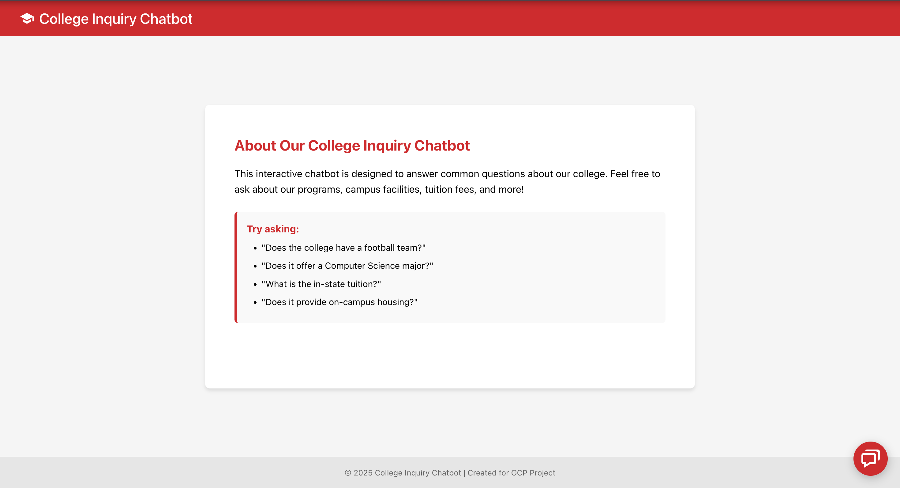
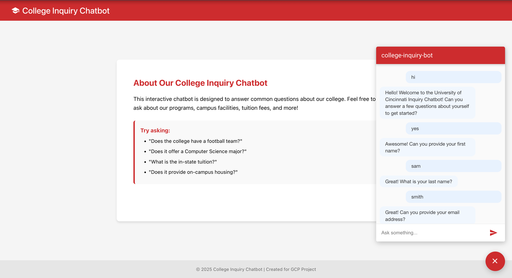

# 🎓 College Inquiry Chatbot

An interactive, cloud-based chatbot designed to answer common student inquiries about a college — such as courses offered, tuition, housing, and extracurriculars. Built with React, Dialogflow Messenger, and deployed using Google Cloud Platform (App Engine).

---

## 🚀 Live Demo

🌐 [Click here to access the deployed chatbot](https://college-inquiry-bot-hdpb.ue.r.appspot.com/)

---

## 📌 Features

- ✅ Collects student information (first name, last name, email)
- 💬 Answers predefined questions like:
  - "Does the college have a football team?"
  - "What is the in-state tuition?"
  - "Does it offer a Computer Science major?"
  - "Does it provide on-campus housing?"
- 🧠 Powered by **Dialogflow Messenger**
- 🧾 Displays a summary of the user's details and creator info at the end
- 🌐 Hosted on **Google App Engine** for scalable cloud deployment
- 🎨 Responsive Web App created using Vite + React

---

## 🛠️ Tech Stack

| Layer         | Technology                |
|---------------|----------------------------|
| Frontend UI   | React + Vite              |
| Chatbot       | Dialogflow ES (Messenger) |
| Deployment    | Google App Engine (PaaS)  |
| Hosting       | Google Cloud Platform     |

---

## 📸 Screenshots

### Web App Interface

### ChatBot Interface

